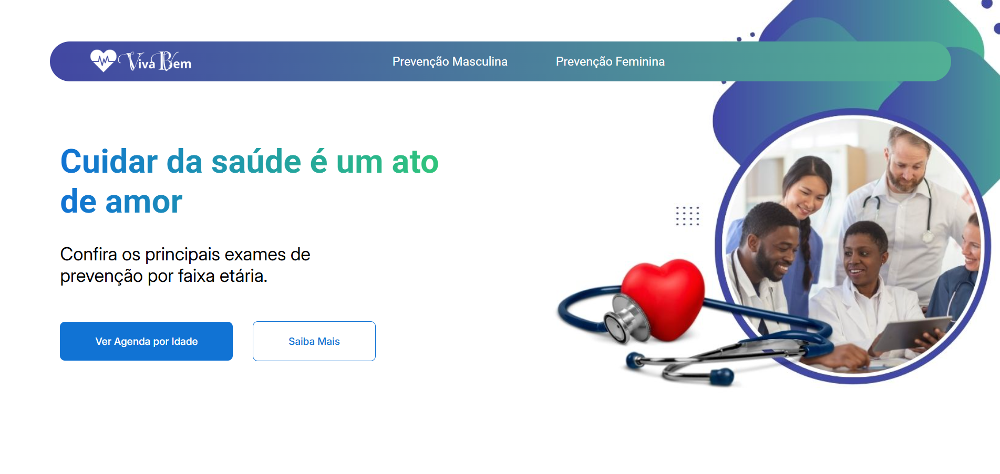
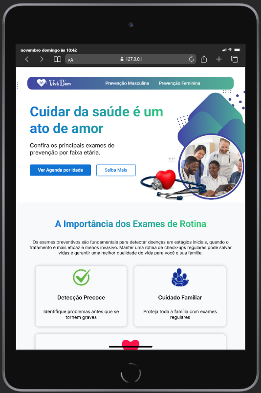
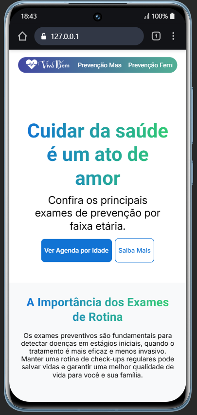
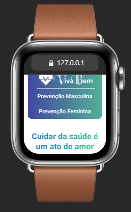
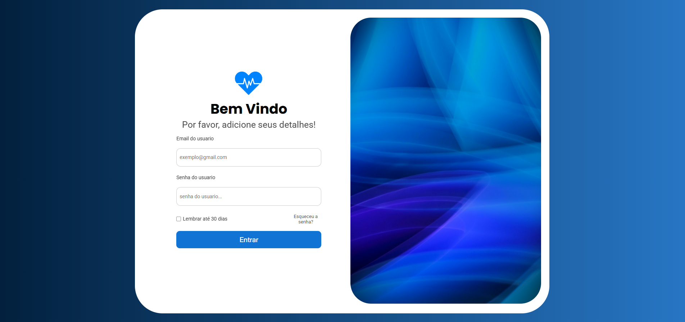
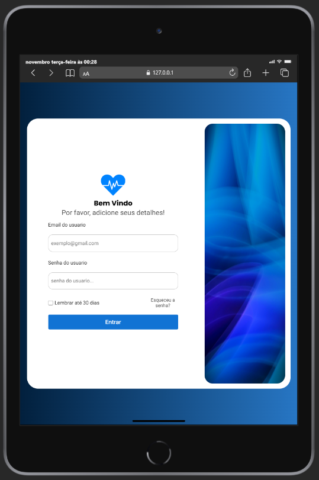

# LiveHealthy - Agenda de Saúde Preventiva

## 📋 Sobre o Projeto

O LiveHealthy é um site informativo sobre saúde preventiva, desenvolvido para auxiliar pessoas a manterem uma rotina de exames e cuidados com a saúde. O projeto apresenta recomendações de exames preventivos por faixa etária, separados por gênero, além de alertas importantes sobre autocuidado.

Email e senha para poder seguir para tela de home do projeto:
- Email: admin.vivabem@gmail.com
- Senha: adm1n__@123

## 🖼️ Desgin

### 🏠 Home

| Desktop                                                       | Tablet                                                      |
| ------------------------------------------------------------- | ----------------------------------------------------------- |
|  |  |

| Mobile                                                                    | SmartWatch                                                          |
| ------------------------------------------------------------------------- | ------------------------------------------------------------------- |
|  |  |

### 🖌️ Login

| Desktop                                                             | Tablet                                                            |
| ------------------------------------------------------------------- | ----------------------------------------------------------------- |
|  |  |

## 🎯 Funcionalidades

- Navegação intuitiva por seções
- Guia de exames preventivos por idade para homens e mulheres
- Alertas importantes sobre autoexame e cuidados básicos
- Design responsivo para diversos dispositivos
- Links úteis para recursos governamentais de saúde

## 🛠 Tecnologias Utilizadas

- HTML5
- CSS3
- SASS/SCSS
- Design Responsivo
- Metodologia BEM CSS

## 🎨 Layout e Design

O site possui um design moderno e limpo, com uma paleta de cores que transmite confiança e profissionalismo:

- Gradientes para títulos e elementos de destaque
- Cards informativos com ícones ilustrativos
- Seções bem definidas com cores específicas por gênero
- Adaptação completa para dispositivos móveis

## 📱 Responsividade

O site é totalmente responsivo, com breakpoints em:

- 1124px
- 850px
- 550px
- 300px

## 📞 Contatos e Links Úteis

- Disque Saúde: 136
- Email: sac@saude.gov.br
- Emergência SAMU: 192

### Links Governamentais

- [Ministério da Saúde](https://www.gov.br/saude/pt-br)
- [INCA](https://www.gov.br/inca/pt-br)
- [SUS](https://www.gov.br/saude/pt-br/sus)

## 🤝 Como Contribuir

1. Faça um fork do projeto
2. Crie uma branch para sua feature (`git checkout -b feature/AmazingFeature`)
3. Commit suas mudanças (`git commit -m 'Add some AmazingFeature'`)
4. Push para a branch (`git push origin feature/AmazingFeature`)
5. Abra um Pull Request

## ⚖️ Licença

© 2025 Agenda de Saúde Preventiva. Informações baseadas em diretrizes médicas nacionais e internacionais.
